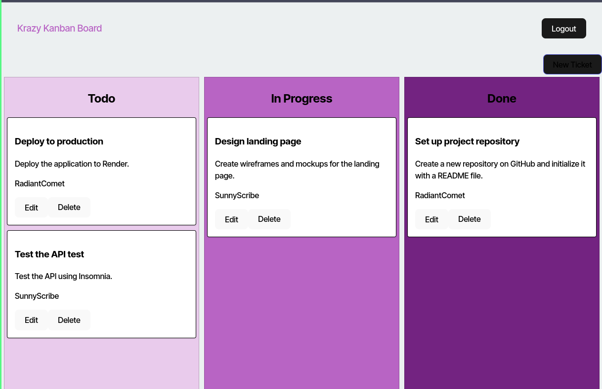

# Kanban Board With Authentication (JWT and bcrypt)

- [Link to app](https://authentication-kanbanboard.onrender.com)

## Description
This project is a Kanban board application with JWT-based authentication. The authentication system is implemented with a class-based approach, providing essential methods to manage user sessions using JSON Web Tokens (JWTs).

## Table of Contents
- [Installation](#installation)
- [Usage](#usage)
- [Technologies Used](#technologies-used)
- [How to Contribute](#how-to-contribute)
- [Questions](#questions)
- [Authors and acknowledgment](#authors-and-acknowledgment)
- [License](#license)

## Installation
run npm -i to install required packages 

## Usage
run npm start to run the app

features:
- **User Authentication**: Handles user login and logout, storing the JWT in `localStorage`.
- **JWT Validation**: Decodes and validates JWT tokens using the `jwt-decode` library.
- **Profile Management**: Retrieves the user profile from the decoded JWT.
- **Token Expiration Handling**: Checks if the JWT has expired to prevent invalid sessions.
- **Frontend Routing**: After login and logout, users are redirected to appropriate routes (home or login page).

## Technologies Used
- HTML5
- CSS3
- JavaScript
- React
- React Router
- Axios
- Git
- Render deploy

## How to Contribute
To contribute create a branch and open a pull request commenting the changes you want to implement

## Questions
You can reach me for questions at [github profile](https://github.com/marioxabel)

## Authors and acknowledgment
- Author: [Mario](https://github.com/marioxabel)
- This was a challenge for the [Tecnológico de Monterrey Coding Boot Camp](https://bootcamp.tec.mx/coding/)

## License
Distributed under the MIT License. [Click to see the full MIT license](https://choosealicense.com/licenses/MIT/).